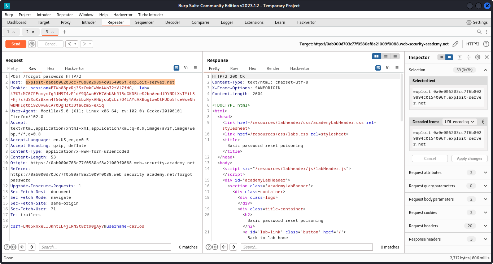

# Basic password reset poisoning

- Go to the login page and notice the "Forgot your password?" functionality. Request a password reset for your own account.
- Go to the exploit server and open the email client. Observe that you have received an email containing a link to reset your password. Notice that the URL contains the query parameter `temp-forgot-password-token`.
- Click the link and observe that you are prompted to enter a new password. Reset your password to whatever you want.
- In Burp, study the HTTP history. Notice that the `POST /forgot-password` request is used to trigger the password reset email. This contains the username whose password is being reset as a body parameter. Send this request to Burp Repeater.
- In Burp Repeater, observe that you can change the Host header to an arbitrary value and still successfully trigger a password reset. Go back to the email server and look at the new email
that you've received. Notice that the URL in the email contains your arbitrary Host header instead of the usual domain name.
- Back in Burp Repeater, change the Host header to your exploit server's domain name (`YOUR-EXPLOIT-SERVER-ID.exploit-server.net`) and change the `username` parameter to `carlos`. Send the request.


- Go to your exploit server and open the access log. You will see a request for `GET /forgot-password` with the `temp-forgot-password-token` parameter containing Carlos's password reset token. Make a note of this token.
- Go to your email client and copy the genuine password reset URL from your first email. Visit this URL in the browser, but replace your reset token with the one you obtained from the access log.
- Change Carlos's password to whatever you want, then log in as `carlos` to solve the lab.

### Why It Works

The vulnerability exists because the application processes user-controlled input without adequate security validation. In this specific lab, the attack succeeds because:

- The application trusts the user input without proper server-side validation
- The input reaches a sensitive operation (database query, HTML rendering, system command, etc.) without sanitization
- The security boundary that should protect the operation is missing or incorrectly implemented
- The specific payload used exploits the exact weakness in the application's input handling

The PortSwigger lab description confirms this: "This lab is vulnerable to password reset poisoning. The user carlos will carelessly click on any links in emails that he receives. To solve the lab, log in to Carlos's account."

### Attack Flow

**Attack Flow:**

```
Attacker Input (payload in request)
        ↓
Application Functionality (processes user input)
        ↓
Server Processing (no validation/sanitization)
        ↓
Injection Point (input reaches sensitive operation)
        ↓
Exploitation (payload executes as intended)
        ↓
Lab Objective Achieved
```

### Real-World Impact

An attacker could hijack password reset emails (account takeover), bypass authentication via virtual host routing, perform web cache poisoning, access internal services via SSRF, or poison intermediate caches.

### Detection / Testing Methodology

1. Test if the application accepts arbitrary Host headers
2. Check if password reset emails include the Host header value
3. Test if routing is affected by Host header manipulation
4. Check for duplicate Host headers or X-Forwarded-Host support
5. Test for web cache poisoning via ambiguous Host headers
6. Check if internal services can be accessed via Host header SSRF

### Remediation

- Always validate the Host header against an allowlist of expected domains
- Use server-side configured base URLs for generating links
- Reject requests with duplicate or ambiguous Host headers
- Do not trust X-Forwarded-Host without validation
- Configure the web server to only accept expected virtual hosts
- Use absolute URLs in email templates

### Key Takeaways

- This lab demonstrates a host header vulnerability in a real-world scenario.
- The vulnerability occurs because user input reaches a sensitive operation without proper validation.
- The PortSwigger lab confirms: "This lab is vulnerable to password reset poisoning. The user carlos will carelessly click on any lin"
- Burp Suite is essential for identifying and exploiting this vulnerability.
- The remediation for this specific vulnerability involves: - Always validate the Host header against an allowlist of expected domains
