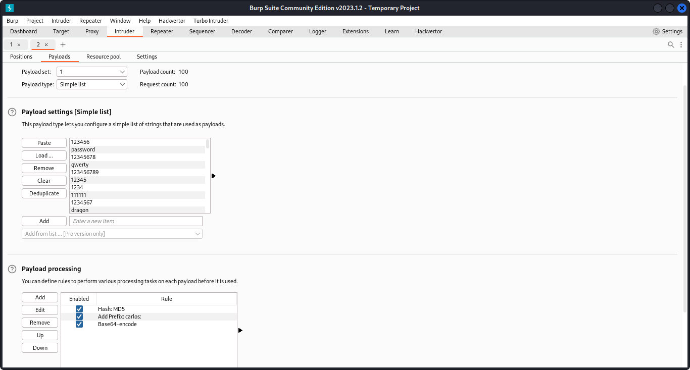
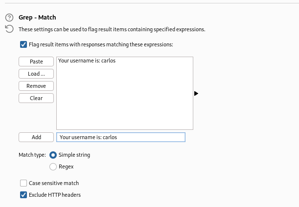

# Brute-forcing a stay-logged-in cookie

- With Burp running, log in to your own account with the **Stay logged in** option selected. Notice that this sets a `stay-logged-in` cookie.
- Examine this cookie in the [Inspector](https://portswigger.net/burp/documentation/desktop/tools/inspector) panel and notice that it is Base64-encoded. Its decoded value is `wiener:51dc30ddc473d43a6011e9ebba6ca770`. Study the length and character set of this string and notice that it could be an MD5 hash. Given that the plaintext is your username, you can make an educated guess that this may be a hash of your password. Hash
your password using MD5 to confirm that this is the case. We now know
that the cookie is constructed as follows: `base64(username+':'+md5HashOfPassword)`
- Log out of your account.
- Send the most recent `GET /my-account` request to Burp Intruder.
- In Burp Intruder, add a payload position to the `stay-logged-in` cookie and add your own password as a single payload.
- Under **Payload processing**, add the following rules in order. These rules will be applied sequentially to each payload before the request is submitted.
  - Hash: `MD5`
  - Add prefix: `wiener:`
  - Encode: `Base64-encode`



- As the **Update email** button is only displayed when you access the `/my-account` page in an authenticated state, we can use the presence or absence of
this button to determine whether we've successfully brute-forced the
cookie. On the **Settings** tab, add a grep match rule to flag any responses containing the string `Update email`. Start the attack.



- Notice that the generated payload was used to
successfully load your own account page. This confirms that the payload
processing rules work as expected and you were able to construct a valid cookie for your own account.
- Make the following adjustments and then repeat this attack:
  - Remove your own password from the payload list and add the list of [candidate passwords](https://portswigger.net/web-security/authentication/auth-lab-passwords) instead.
  - Change the **Add prefix** rule to add `carlos:` instead of `wiener:`.
- When the attack is finished, the lab will be
solved. Notice that only one request returned a response containing `Update email`. The payload from this request is the valid `stay-logged-in` cookie for Carlos's account.

### Why It Works

The vulnerability exists because the application processes user-controlled input without adequate security validation. In this specific lab, the attack succeeds because:

- The application trusts the user input without proper server-side validation
- The input reaches a sensitive operation (database query, HTML rendering, system command, etc.) without sanitization
- The security boundary that should protect the operation is missing or incorrectly implemented
- The specific payload used exploits the exact weakness in the application's input handling

The PortSwigger lab description confirms this: "This lab allows users to stay logged in even after they close their browser session. The cookie used to provide this functionality is vulnerable to brute-forcing."

### Attack Flow

**Attack Flow:**

```
Attacker Input (payload in request)
        ↓
Application Functionality (processes user input)
        ↓
Server Processing (no validation/sanitization)
        ↓
Injection Point (input reaches sensitive operation)
        ↓
Exploitation (payload executes as intended)
        ↓
Lab Objective Achieved
```

### Real-World Impact

An attacker could take over user accounts by brute-forcing passwords, bypass 2FA protections, enumerate valid usernames for targeted phishing, maintain persistent access via forged cookies, hijack OAuth flows, or reset any user's password.

### Detection / Testing Methodology

1. Test login responses for username enumeration (different messages/timing)
2. Test brute-force protections (IP blocking, account lockout, CAPTCHA)
3. Examine stay-logged-in cookies (decode, check if forgeable)
4. Test password reset flows (email injection, Host header manipulation)
5. For 2FA: test bypass via forced browsing, OTP brute-force, replay
6. For OAuth: test redirect_uri manipulation, access token theft

### Remediation

- Return identical error messages for all authentication failures ('Invalid credentials')
- Implement consistent response timing
- Use strong rate-limiting (per-account and per-IP)
- Require re-authentication for sensitive actions
- Use server-generated, unguessable password reset tokens
- For OAuth: validate redirect_uri against a strict allowlist, use state parameter
- For 2FA: enforce server-side, never skip via forced browsing

### Key Takeaways

- This lab demonstrates a authentication vulnerability in a real-world scenario.
- The vulnerability occurs because user input reaches a sensitive operation without proper validation.
- The PortSwigger lab confirms: "This lab allows users to stay logged in even after they close their browser session. The cookie used"
- Burp Suite is essential for identifying and exploiting this vulnerability.
- The remediation for this specific vulnerability involves: - Return identical error messages for all authentication failures ('Invalid credentials')
