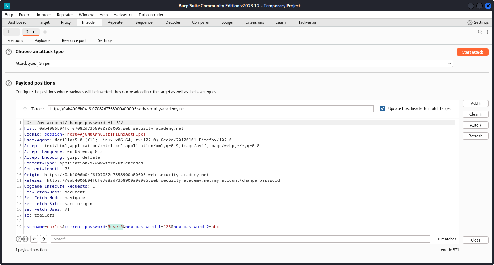
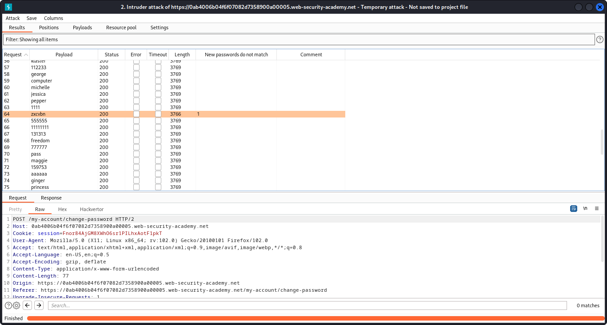

# Password brute-force via password change

- With Burp running, log in and experiment with the password change functionality. Observe that the username is submitted as hidden input in the request.
- Notice the behavior when you enter the wrong current password. If the two entries for the new password match, the account is locked. However, if you enter two different new passwords, an error message simply states `Current password is incorrect`. If you enter a valid current password, but two different new passwords, the message says `New passwords do not match`. We can use this message to enumerate correct passwords.
- Enter your correct current password and two new passwords that do not match. Send this `POST /my-account/change-password` request to Burp Intruder.
- In Burp Intruder, change the `username` parameter to `carlos` and add a payload position to the `current-password` parameter. Make sure that the new password parameters are set to two different values. For example: `username=carlos&current-password=§incorrect-password§&new-password-1=123&new-password-2=abc`
- On the **Payloads** tab, enter the list of passwords as the payload set
- On the **Settings** tab, add a grep match rule to flag responses containing `New passwords do not match`. Start the attack.
- When the attack finished, notice that one response was found that contains the `New passwords do not match` message. Make a note of this password.
- In the browser, log out of your own account and lock back in with the username `carlos` and the password that you just identified.





- Click **My account** to solve the lab.

### Why It Works

The vulnerability exists because the application processes user-controlled input without adequate security validation. In this specific lab, the attack succeeds because:

- The application trusts the user input without proper server-side validation
- The input reaches a sensitive operation (database query, HTML rendering, system command, etc.) without sanitization
- The security boundary that should protect the operation is missing or incorrectly implemented
- The specific payload used exploits the exact weakness in the application's input handling

The PortSwigger lab description confirms this: "This lab's password change functionality makes it vulnerable to brute-force attacks. To solve the lab, use the list of candidate passwords to brute-force Carlos's account and access his &quot;My accou"

### Attack Flow

**Attack Flow:**

```
Attacker Input (payload in request)
        ↓
Application Functionality (processes user input)
        ↓
Server Processing (no validation/sanitization)
        ↓
Injection Point (input reaches sensitive operation)
        ↓
Exploitation (payload executes as intended)
        ↓
Lab Objective Achieved
```

### Real-World Impact

An attacker could take over user accounts by brute-forcing passwords, bypass 2FA protections, enumerate valid usernames for targeted phishing, maintain persistent access via forged cookies, hijack OAuth flows, or reset any user's password.

### Detection / Testing Methodology

1. Test login responses for username enumeration (different messages/timing)
2. Test brute-force protections (IP blocking, account lockout, CAPTCHA)
3. Examine stay-logged-in cookies (decode, check if forgeable)
4. Test password reset flows (email injection, Host header manipulation)
5. For 2FA: test bypass via forced browsing, OTP brute-force, replay
6. For OAuth: test redirect_uri manipulation, access token theft

### Remediation

- Return identical error messages for all authentication failures ('Invalid credentials')
- Implement consistent response timing
- Use strong rate-limiting (per-account and per-IP)
- Require re-authentication for sensitive actions
- Use server-generated, unguessable password reset tokens
- For OAuth: validate redirect_uri against a strict allowlist, use state parameter
- For 2FA: enforce server-side, never skip via forced browsing

### Key Takeaways

- This lab demonstrates a authentication vulnerability in a real-world scenario.
- The vulnerability occurs because user input reaches a sensitive operation without proper validation.
- The PortSwigger lab confirms: "This lab's password change functionality makes it vulnerable to brute-force attacks. To solve the la"
- Burp Suite is essential for identifying and exploiting this vulnerability.
- The remediation for this specific vulnerability involves: - Return identical error messages for all authentication failures ('Invalid credentials')
