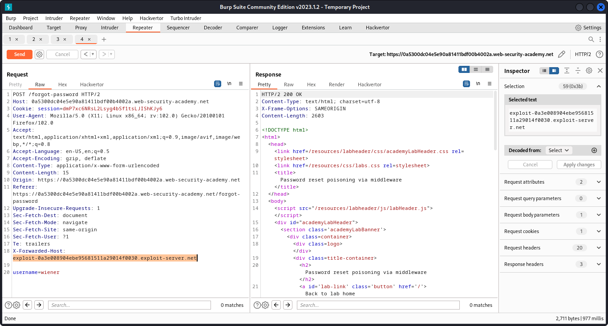
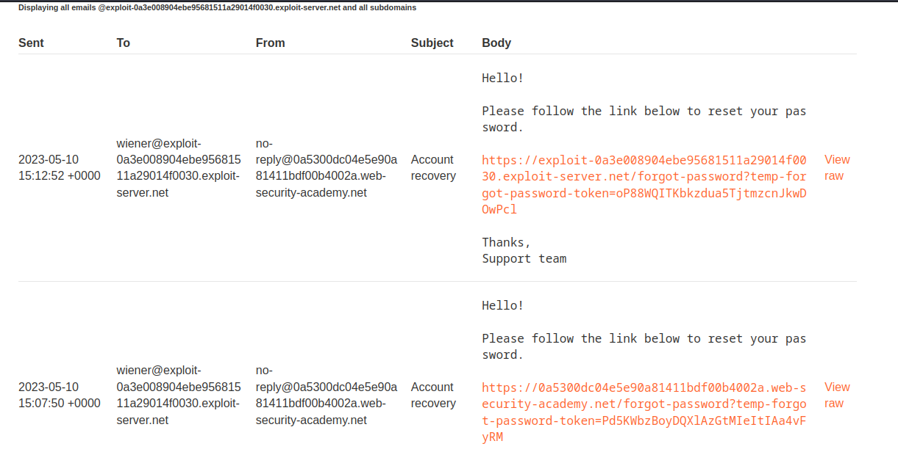

# Password reset poisoning via middleware

- With Burp running, investigate the password reset functionality.Observe that a link containing a unique reset token is sent via email.
- Send the `POST /forgot-password` request to Burp Repeater. Notice that the `X-Forwarded-Host` header is supported and you can use it to point the dynamically generated reset link to an arbitrary domain.

- notice difference in link normal vs exploited


💡 we need to click on manipulated link to see reset token in access log

- Go to the exploit server and make a note of your exploit server URL.
- Go back to the request in Burp Repeater and add the `X-Forwarded-Host` header with your exploit server URL: `X-Forwarded-Host: YOUR-EXPLOIT-SERVER-ID.exploit-server.net`
- Change the `username` parameter to `carlos` and send the request.
- Go to the exploit server and open the access log. You should see a `GET /forgot-password` request, which contains the victim's token as a query parameter. Make a note of this token.
- Go back to your email client and copy the valid password reset link (not the one that points to the exploit server).Paste this into the browser and change the value of the `temp-forgot-password-token` parameter to the value that you stole from the victim.
- Load this URL and set a new password for Carlos's account.
- Log in to Carlos's account using the new password to solve the lab.


### Why It Works

The exploit succeeds because this lab is vulnerable to password reset poisoning via dangling markup. to solve the lab, log in to carlos's account.

The official solution confirms: Go to the login page and request a password reset for your own account. Go to the exploit server and open the email client to find the password reset 

The root cause is a failure in the application's security architecture specific to this host header scenario — the server does not properly validate or secure the user-controlled input that reaches the vulnerable operation.

### Key Takeaways

- The vulnerability is exploitable because user input reaches a sensitive operation without adequate server-side validation.
- PortSwigger confirms: "This lab is vulnerable to password reset poisoning via dangling markup. To solve the lab, log in to "
- Validate the Host header against an allowlist of expected domains.

## PortSwigger Lab

**Official lab:** Password reset poisoning via middleware

**PortSwigger:** https://portswigger.net/web-security/authentication/other-mechanisms/lab-password-reset-poisoning-via-middleware
