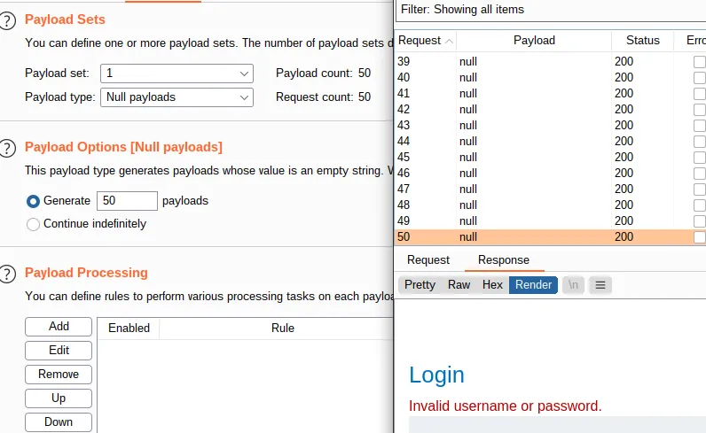

# Username enumeration via account lock

[Username enumeration via account lock](https://portswigger.net/web-security/authentication/password-based/lab-username-enumeration-via-account-lock)

I try to login with an (allegedly) invalid username and see if it locks me out based on my IP.

For this, I use the null payload option to generate 50 login attempts. But even after the 50th request, it still states ‘Invalid username or password’ and does not mention any lockout.

That means it does not trigger based on login attempts from one source, but on existing accounts only. So I repeat the last step, this time making multiple requests for each possible username and see whether there is a different behavior or message.

- With Burp running, investigate the login page and submit an invalid username and password. Send the `POST /login` request to Burp Intruder.
- Select the attack type **Cluster bomb**. Add a payload position to the `username` parameter. Add a blank payload position to the end of the request body by clicking **Add §** twice. The result should look something like this: `username=§invalid-username§&password=example§§`
- On the **Payloads** tab, add the list of usernames to the first payload set. For the second set, select the **Null payloads** type and choose the option to generate 5 payloads. This will
effectively cause each username to be repeated 5 times. Start the attack.
- In the results, notice that the responses for one of the usernames were longer than responses when using other usernames. Study the response more closely and notice that it contains a different error message: `You have made too many incorrect login attempts.` Make a note of this username.
- Create a new Burp Intruder attack on the `POST /login` request, but this time select the **Sniper** attack type. Set the `username` parameter to the username that you just identified and add a payload position to the `password` parameter.
- Add the list of passwords to the payload set and create a grep extraction rule for the error message. Start the attack.
- In the results, look at the grep extract column. Notice that there are a couple of different error messages, but one of the responses did not contain any error message. Make a note of this
password.
- Wait for a minute to allow the account lock to reset. Log in using the username and password that you identified and access the user account page to solve the lab.

## PortSwigger Lab

**Official lab:** Username enumeration via account lock

**PortSwigger:** https://portswigger.net/web-security/authentication/password-based/lab-username-enumeration-via-account-lock
