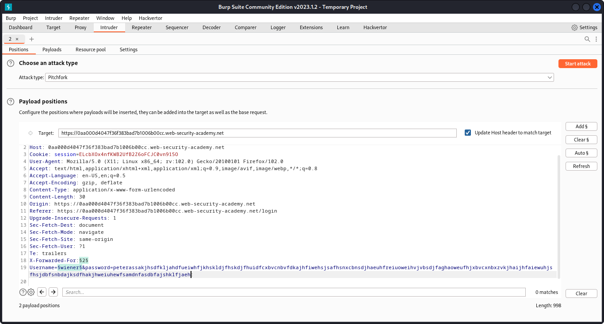
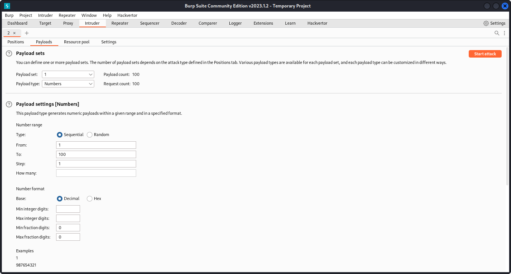
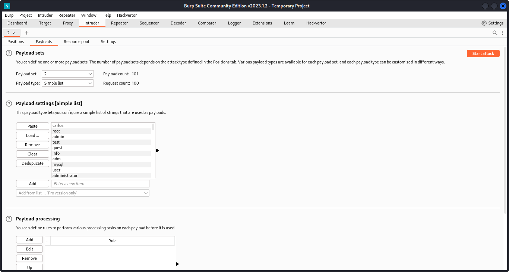
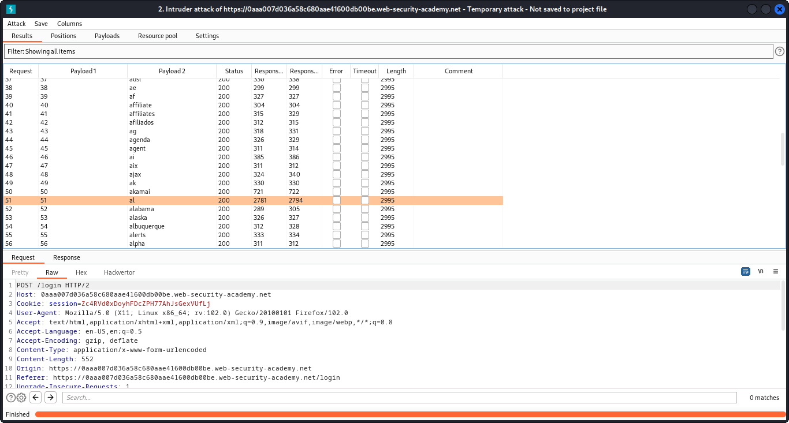
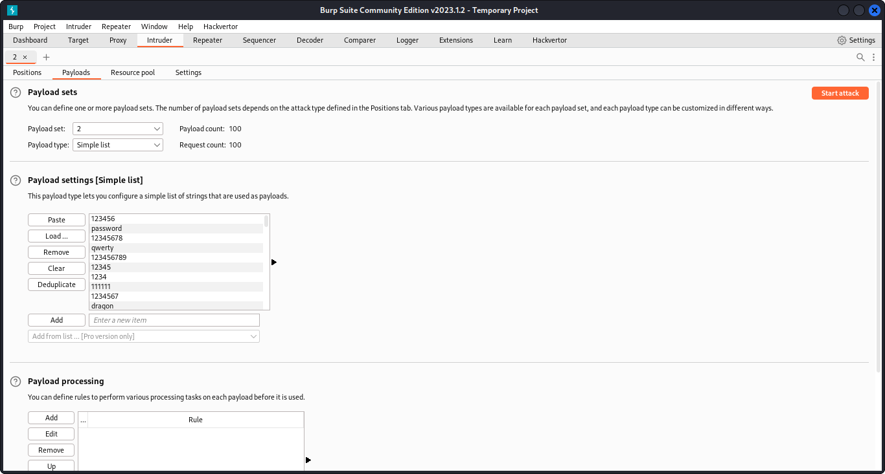
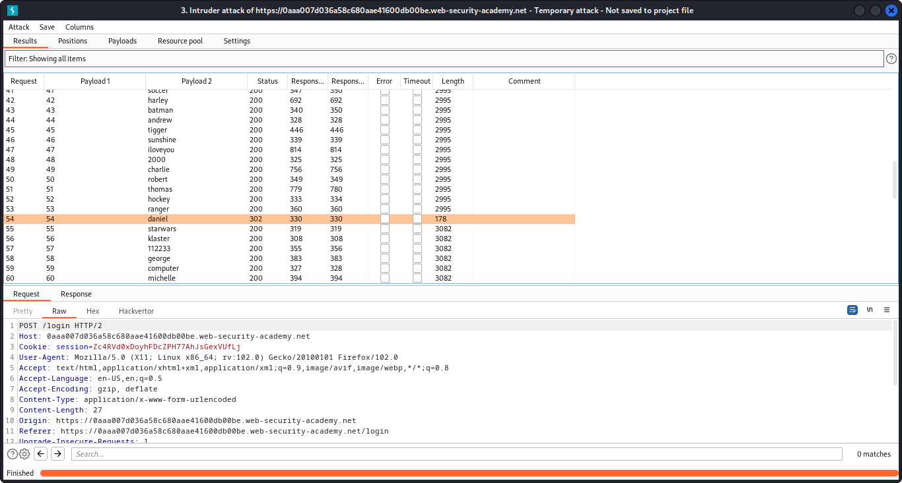

# Username enumeration via response timing

[https://portswigger.net/web-security/authentication/password-based/lab-username-enumeration-via-response-timing](https://portswigger.net/web-security/authentication/password-based/lab-username-enumeration-via-response-timing)

- With Burp running, submit an invalid username and password, then send the `POST /login` request to Burp Repeater. Experiment with different usernames and
passwords. Notice that your IP will be blocked if you make too many
invalid login attempts.
- Identify that the `X-Forwarded-For` header is supported, which allows you to spoof your IP address and bypass the IP-based brute-force protection.
- Continue experimenting with usernames and passwords. Pay
particular attention to the response times. Notice that when the
username is invalid, the response time is roughly the same. However,
when you enter a valid username (your own), the response time is
increased depending on the length of the password you entered.
- Send this request to Burp Intruder and select the attack type to **Pitchfork**. Clear the default payload positions and add the `X-Forwarded-For` header.

- Add payload positions for the `X-Forwarded-For` header and the `username` parameter. Set the password to a very long string of characters (about 100 characters should do it).
- On the **Payloads** tab, select payload set 1. Select the **Numbers** payload type. Enter the range 1 - 100 and set the step to 1. Set the max fraction digits to 0. This will be used to spoof your IP.

- Select payload set 2 and add the list of usernames. Start the attack.

- When the attack finishes, at the top of the dialog, click **Columns** and select the **Response received** and **Response completed** options. These two columns are now displayed in the results table.


💡 al is username

- Notice that one of the response times was significantly longer
than the others. Repeat this request a few times to make sure it
consistently takes longer, then make a note of this username.
- Create a new Burp Intruder attack for the same request. Add the `X-Forwarded-For` header again and add a payload position to it. Insert the username that you just identified and add a payload position to the `password` parameter.

- On the **Payloads** tab, add the list of numbers in payload set 1 and add the list of passwords to payload set 2. Start the attack.
- When the attack is finished, find the response with a `302` status. Make a note of this password.

- Log in using the username and password that you identified and access the user account page to solve the lab.


### Why It Works

The exploit succeeds because this lab is vulnerable to username enumeration. it uses account locking, but this contains a logic flaw. to solve the lab, enumerate a valid username, brute-force this user's password, then access the

The official solution confirms: With Burp running, investigate the login page and submit an invalid username and password. Send the POST /login request to Burp Intruder. Select Clust

The root cause is a failure in the application's security architecture specific to this authentication scenario — the server does not properly validate or secure the user-controlled input that reaches the vulnerable operation.

### Key Takeaways

- This lab contains logic flaw, demonstrating how authentication vulnerabilities manifest in real applications.
- The vulnerability is exploitable because user input reaches a sensitive operation without adequate server-side validation.
- PortSwigger confirms: "This lab is vulnerable to username enumeration. It uses account locking, but this contains a logic f"
- Consistent error messages and rate-limiting prevent enumeration and brute-force.
